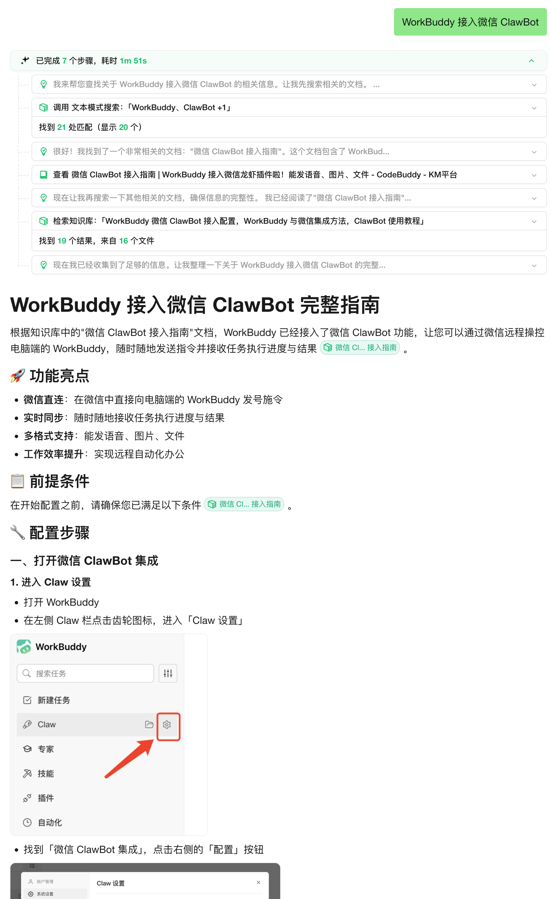

<p align="center">
  <picture>
    
  </picture>
</p>

<p align="center">
  <picture>
    <a href="https://trendshift.io/repositories/15289" target="_blank">
      
    </a>
  </picture>
</p>
<p align="center">
    <a href="https://weknora.weixin.qq.com" target="_blank">
        
    </a>
    <a href="https://chatbot.weixin.qq.com" target="_blank">
        
    </a>
    <a href="https://github.com/Tencent/WeKnora/blob/main/LICENSE">
        
    </a>
    <a href="./CHANGELOG.md">
        
    </a>
</p>

<p align="center">
| <a href="./README.md"><b>English</b></a> | <b>简体中文</b> | <a href="./README_JA.md"><b>日本語</b></a> | <a href="./README_KO.md"><b>한국어</b></a> |
</p>

<p align="center">
  <h4 align="center">

  [项目介绍](#-项目介绍) • [架构设计](#-架构设计) • [核心特性](#-核心特性) • [快速开始](#-快速开始) • [文档](#-文档) • [开发指南](#-开发指南)

  </h4>
</p>

# 💡 WeKnora - 基于大模型的文档理解检索框架

## 📌 项目介绍

**[WeKnora（维娜拉）](https://weknora.weixin.qq.com)** 是一款基于大语言模型（LLM）的文档理解与语义检索框架，专为结构复杂、内容异构的文档场景而打造。

框架采用模块化架构，融合多模态预处理、语义向量索引、智能召回与大模型生成推理，构建起高效、可控的文档问答流程。核心检索流程基于 **RAG（Retrieval-Augmented Generation）** 机制，将上下文相关片段与语言模型结合，实现更高质量的语义回答。

**官网：** [https://weknora.weixin.qq.com](https://weknora.weixin.qq.com)

## ✨ 最新更新

**v0.3.5 版本亮点：**

- **Telegram、ding'ding & Mattermost IM集成**：新增Telegram机器人（webhook/长轮询，流式editMessageText回复）、钉钉机器人（webhook/Stream模式，AI卡片流式输出）和Mattermost适配器；IM频道现已覆盖企业微信、飞书、Slack、Telegram、钉钉、Mattermost共6个平台
- **IM斜杠命令与QA队列**：可插拔斜杠命令框架（/help、/info、/search、/stop、/clear），配合有界QA工作池、用户级限流和基于Redis的多实例分布式协调
- **推荐问题**：Agent基于关联知识库自动生成上下文相关的推荐问题，在对话界面开场前展示；图片知识自动触发问题生成任务
- **VLM自动描述MCP工具返回图片**：当MCP工具返回图片时，Agent通过配置的VLM模型自动生成文字描述，使不支持图片输入的LLM也能理解图片内容
- **Novita AI提供商**：新增Novita AI，通过OpenAI兼容接口支持Chat、Embedding和VLLM模型类型
- **MCP工具名称稳定性**：工具名称改为基于service.Name（跨重连保持稳定），新增唯一名称约束和碰撞防护；前端将snake_case工具名格式化为可读形式
- **来源频道标记**：知识条目和消息新增channel字段，记录来源（web/api/im/browser_extension），便于追溯
- **重要修复**：修复无知识库时Agent空响应、中文/emoji文档摘要UTF-8截断、租户设置更新时API密钥加密丢失、vLLM流式推理内容缺失、Rerank空段落过滤等问题

**v0.3.4 版本亮点：**

- **IM机器人集成**：支持企业微信、飞书、Slack IM频道，WebSocket/Webhook双模式，流式回复与知识库集成
- **多模态图片支持**：图片上传与多模态图片处理，增强会话管理能力
- **手动知识下载**：支持手动知识内容导出下载，文件名清洗与格式化处理
- **NVIDIA模型API**：支持NVIDIA聊天模型API，自定义端点及VLM模型配置
- **Weaviate向量数据库**：新增Weaviate向量数据库后端，用于知识检索
- **AWS S3存储**：集成AWS S3存储适配器，配置界面及数据库迁移
- **AES-256-GCM加密**：API密钥静态加密，采用AES-256-GCM增强安全性
- **内置MCP服务**：支持内置MCP服务，扩展Agent能力
- **混合检索优化**：按目标分组并复用查询向量，提升检索性能
- **Final Answer工具**：新增final_answer工具及Agent耗时跟踪，优化Agent工作流

<details>
<summary><b>更早版本</b></summary>

**v0.3.3 版本亮点：**

- **父子分块策略**：层级化的父子分块策略，增强上下文管理和检索精度
- **知识库置顶**：支持置顶常用知识库，快速访问
- **兜底回复**：无相关结果时的兜底回复处理及UI指示
- **Rerank段落清洗**：Rerank模型段落清洗功能，提升相关性评分准确度
- **存储桶自动创建**：存储引擎连通性检查增强，支持自动创建存储桶
- **Milvus向量数据库**：新增Milvus向量数据库后端，用于知识检索

**v0.3.2 版本亮点：**

- 🔍 **知识搜索**：新增"知识搜索"入口，支持语义检索，可将检索结果直接带入对话窗口
- ⚙️ **解析引擎与存储引擎配置**：设置中支持配置各个来源的文档解析引擎和存储引擎信息，知识库中支持为不同类型文件选择不同的解析引擎
- 🖼️ **本地存储图片渲染**：本地存储模式下支持对话过程中图片的渲染，流式输出中图片占位效果优化
- 📄 **文档预览**：使用内嵌的文档预览组件预览用户上传的原始文件
- 🎨 **交互优化**：知识库、智能体、共享空间列表页面交互全面优化
- 🗄️ **Milvus支持**：新增Milvus向量数据库后端，用于知识检索
- 🌋 **火山引擎TOS**：新增火山引擎TOS对象存储支持
- 📊 **Mermaid渲染**：对话中支持Mermaid图表渲染，全屏查看器支持缩放、导航和导出
- 💬 **对话批量管理**：支持批量管理和一键删除所有会话
- 🔗 **远程URL创建知识**：支持从远程文件URL创建知识条目
- 🧠 **记忆图谱预览**：用户级记忆图谱可视化预览
- 🔄 **异步重新解析**：支持异步API重新解析已有知识文档

**v0.3.0 版本亮点：**

- 🏢 **共享空间**：共享空间管理，支持成员邀请、知识库和Agent跨成员共享，租户隔离检索
- 🧩 **Agent Skills**：Agent技能系统，预置智能推理技能，基于沙盒的安全隔离执行环境
- 🤖 **自定义Agent**：支持创建、配置和选择自定义Agent，知识库选择模式（全部/指定/禁用）
- 📊 **数据分析Agent**：内置数据分析Agent，DataSchema工具支持CSV/Excel分析
- 🧠 **思考模式**：支持LLM和Agent思考模式，智能过滤思考内容
- 🔍 **搜索引擎扩展**：新增Bing和Google搜索引擎，与DuckDuckGo并列可选
- 📋 **FAQ增强**：批量导入预检、相似问题、搜索结果匹配问题字段、大批量导入卸载至对象存储
- 🔑 **API Key认证**：API Key认证机制，Swagger文档安全配置
- 📎 **输入框内选择**：输入框中直接选择知识库和文件，@提及显示
- ☸️ **Helm Chart**：完整的Kubernetes部署Helm Chart，支持Neo4j图谱
- 🌍 **国际化**：新增韩语（한국어）支持
- 🔒 **安全加固**：SSRF安全HTTP客户端、增强SQL验证、MCP stdio传输安全、沙盒化执行
- ⚡ **基础设施**：Qdrant向量数据库支持、Redis ACL、可配置日志级别、Ollama嵌入优化、`DISABLE_REGISTRATION`控制

**v0.2.0 版本亮点：**

- 🤖 **Agent模式**：新增ReACT Agent模式，支持调用内置工具、MCP工具和网络搜索，通过多次迭代和反思提供全面总结报告
- 📚 **多类型知识库**：支持FAQ和文档两种类型知识库，新增文件夹导入、URL导入、标签管理和在线录入功能
- ⚙️ **对话策略**：支持配置Agent模型、普通模式模型、检索阈值和Prompt，精确控制多轮对话行为
- 🌐 **网络搜索**：支持可扩展的网络搜索引擎，内置DuckDuckGo搜索引擎
- 🔌 **MCP工具集成**：支持通过MCP扩展Agent能力，内置uvx、npx启动工具，支持多种传输方式
- 🎨 **全新UI**：优化对话界面，支持Agent模式/普通模式切换，展示工具调用过程，知识库管理界面全面升级
- ⚡ **底层升级**：引入MQ异步任务管理，支持数据库自动迁移，提供快速开发模式

</details>

## 🔒 安全声明

**重要提示：** 从 v0.1.3 版本开始，WeKnora 提供了登录鉴权功能，以增强系统安全性。在生产环境部署时，我们强烈建议：

- 将 WeKnora 服务部署在内网/私有网络环境中，而非公网环境
- 避免将服务直接暴露在公网上，以防止重要信息泄露风险
- 为部署环境配置适当的防火墙规则和访问控制
- 定期更新到最新版本以获取安全补丁和改进

## 🏗️ 架构设计


WeKnora 采用现代化模块化设计，构建了一条完整的文档理解与检索流水线。系统主要包括文档解析、向量化处理、检索引擎和大模型推理等核心模块，每个组件均可灵活配置与扩展。

## 🎯 核心特性

- **🤖 Agent模式**：支持ReACT Agent模式，可调用内置工具检索知识库、MCP工具和网络搜索，通过多次迭代和反思给出全面总结报告
- **🔍 精准理解**：支持 PDF、Word、图片等文档的结构化内容提取，统一构建语义视图
- **🧠 智能推理**：借助大语言模型理解文档上下文与用户意图，支持精准问答与多轮对话
- **📚 多类型知识库**：支持FAQ和文档两种类型知识库，支持文件夹导入、URL导入、标签管理和在线录入
- **🔧 灵活扩展**：从解析、嵌入、召回到生成全流程解耦，便于灵活集成与定制扩展
- **⚡ 高效检索**：混合多种检索策略：关键词、向量、知识图谱，支持跨知识库检索
- **🌐 网络搜索**：支持可扩展的网络搜索引擎，内置DuckDuckGo搜索引擎
- **🔌 MCP工具集成**：支持通过MCP扩展Agent能力，内置uvx、npx启动工具，支持多种传输方式
- **⚙️ 对话策略**：支持配置Agent模型、普通模式模型、检索阈值和Prompt，精确控制多轮对话行为
- **🎯 简单易用**：直观的Web界面与标准API，零技术门槛快速上手
- **🔒 安全可控**：支持本地化与私有云部署，数据完全自主可控

## 📊 适用场景


| 应用场景       | 具体应用                 | 核心价值              |
| ---------- | -------------------- | ----------------- |
| **企业知识管理** | 内部文档检索、规章制度问答、操作手册查询 | 提升知识查找效率，降低培训成本   |
| **科研文献分析** | 论文检索、研究报告分析、学术资料整理   | 加速文献调研，辅助研究决策     |
| **产品技术支持** | 产品手册问答、技术文档检索、故障排查   | 提升客户服务质量，减少技术支持负担 |
| **法律合规审查** | 合同条款检索、法规政策查询、案例分析   | 提高合规效率，降低法律风险     |
| **医疗知识辅助** | 医学文献检索、诊疗指南查询、病例分析   | 辅助临床决策，提升诊疗质量     |


## 🧩 功能模块能力


| 功能模块    | 支持情况                                                               | 说明                                                                                      |
| ------- | ------------------------------------------------------------------ | --------------------------------------------------------------------------------------- |
| Agent模式 | ✅ ReACT Agent模式                                                    | 内置工具检索知识库、调用MCP工具和网络搜索；支持跨知识库检索与多轮迭代推理                                                  |
| 知识库类型   | ✅ FAQ / 文档                                                         | FAQ和文档两种类型，支持文件夹导入、URL导入、标签管理、在线录入和知识迁移                                                 |
| 文档格式支持  | ✅ PDF / Word / Txt / Markdown / HTML / 图片（OCR + Caption）           | 结构化与非结构化文档解析；图片OCR文字提取；VLM图片描述生成                                                        |
| IM频道集成  | ✅ 企业微信 / 飞书 / Slack / Telegram / 钉钉 / Mattermost                   | WebSocket和Webhook双模式；流式回复；斜杠命令（/help、/info、/search、/stop、/clear）；用户级限流；基于Redis的多实例分布式协调 |
| 模型管理    | ✅ 集中配置、内置模型共享                                                      | 模型集中配置，知识库级别模型选择，支持多租户共享内置模型                                                            |
| 嵌入模型支持  | ✅ 本地模型（Ollama）、BGE / GTE / OpenAI兼容接口                              | 支持自定义embedding模型，兼容本地部署与云端向量生成接口                                                        |
| 向量数据库接入 | ✅ PostgreSQL（pgvector）/ Elasticsearch / Milvus / Weaviate / Qdrant | 五种向量索引后端，可灵活切换，适配不同检索场景                                                                 |
| 对象存储    | ✅ 本地 / MinIO / AWS S3 / 火山引擎TOS                                    | 可插拔存储适配器；启动时自动创建存储桶                                                                     |
| 检索机制    | ✅ BM25 / Dense Retrieve / GraphRAG                                 | 稠密/稀疏召回、知识图谱增强检索；可自由组合召回-重排-生成流程                                                        |
| 大模型集成   | ✅ Qwen / DeepSeek / MiniMax / NVIDIA / Novita AI / OpenAI兼容        | 接入本地大模型（Ollama）或外部API服务；思考/非思考模式切换；vLLM流式推理内容支持                                         |
| 对话策略    | ✅ Agent模型、普通模式模型、检索阈值、Prompt配置                                     | 在线Prompt编辑；检索阈值调节；精确控制多轮对话行为                                                            |
| 网络搜索    | ✅ DuckDuckGo / Bing / Google（可扩展）                                  | 可插拔搜索引擎；按对话开关网络搜索                                                                       |
| MCP工具   | ✅ uvx / npx启动工具，Stdio / HTTP Streamable / SSE                      | 通过MCP扩展Agent能力；工具名称稳定（跨重连保持一致）；VLM自动描述工具返回图片                                            |
| 推荐问题    | ✅ 基于知识库的问题推荐                                                       | Agent在对话前展示推荐问题；图片知识自动触发问题生成                                                            |
| 问答能力    | ✅ 上下文感知、多轮对话、提示词模板                                                 | 复杂语义建模、指令控制与链式问答，可配置提示词与上下文窗口                                                           |
| 安全机制    | ✅ AES-256-GCM静态加密、SSRF防护                                           | API密钥静态加密；远程API调用的SSRF安全校验；Agent技能沙盒执行                                                  |
| 端到端测试支持 | ✅ 检索+生成过程可视化与指标评估                                                  | 一体化链路测试，支持评估召回命中率、回答覆盖度、BLEU/ROUGE等指标                                                   |
| 部署模式    | ✅ 本地 / Docker / Kubernetes（Helm）                                   | 私有化和离线部署；热重载快速开发模式；Helm Chart支持Kubernetes部署                                             |
| 用户界面    | ✅ Web UI + RESTful API                                             | 交互式界面与标准API；Agent/普通模式切换；工具调用过程可视化                                                      |
| 任务管理    | ✅ MQ异步任务、数据库自动迁移                                                   | MQ异步任务状态维护；版本升级时自动执行数据库表结构和数据迁移                                                         |


## 🚀 快速开始

### 🛠 环境要求

确保本地已安装以下工具：

- [Docker](https://www.docker.com/)
- [Docker Compose](https://docs.docker.com/compose/)
- [Git](https://git-scm.com/)

### 📦 安装步骤

#### ① 克隆代码仓库

```bash
# 克隆主仓库
git clone https://github.com/Tencent/WeKnora.git
cd WeKnora
```

#### ② 配置环境变量

```bash
# 复制示例配置文件
cp .env.example .env

# 编辑 .env，填入对应配置信息
# 所有变量说明详见 .env.example 注释
```

#### ③ 启动主服务

检查 `.env` 文件中需要启动的镜像，然后使用 Docker Compose 启动 WeKnora 主服务。

```bash
docker compose up -d
```

#### ③.0 单独启动 Ollama（可选）

如果你在 `.env` 中配置了本地 Ollama 模型，还需要额外启动 Ollama 服务：

```bash
ollama serve > /dev/null 2>&1 &
```

#### ③.1 激活不同组合的功能

- 启动最小功能

```bash
docker compose up -d
```

- 启动全部功能

```bash
docker compose --profile full up -d
```

- 需要 tracing 日志

```bash
docker compose --profile jaeger up -d
```

- 需要 neo4j 知识图谱

```bash
docker compose --profile neo4j up -d
```

- 需要 minio 文件存储服务

```bash
docker compose --profile minio up -d
```

- 多选项组合

```bash
docker compose --profile neo4j --profile minio up -d
```

#### ④ 停止服务

```bash
docker compose down
```

### 🌐 服务访问地址

启动成功后，可访问以下地址：

- Web UI：`http://localhost`
- 后端 API：`http://localhost:8080`
- 链路追踪（Jaeger）：`http://localhost:16686`

## 📱 功能展示

### Web UI 界面

<table>
  <tr>
    <td><b>知识库管理</b><br/></td>
    <td><b>对话设置</b><br/></td>
  </tr>
  <tr>
    <td colspan="2"><b>智能问答对话</b><br/></td>
  </tr>
  <tr>
    <td colspan="2"><b>Agent模式工具调用过程</b><br/></td>
  </tr>
</table>


**知识库管理：** 支持创建FAQ和文档两种类型知识库，支持拖拽上传、文件夹导入、URL导入等多种方式，自动识别文档结构并提取核心知识，建立索引。支持标签管理和在线录入，系统清晰展示处理进度和文档状态，实现高效的知识库管理。

**Agent模式：** 支持开启ReACT Agent模式，可使用内置工具检索知识库，调用用户配置的MCP工具和网络搜索工具访问外部服务，通过多次迭代和反思，最终给出全面的总结报告。支持跨知识库检索，可以选择多个知识库同时检索。

**对话策略：** 支持配置Agent模型、普通模式所需的模型、检索阈值，支持在线配置Prompt，精确控制多轮对话行为和检索召回执行方式。对话输入框支持Agent模式/普通模式切换，支持开启和关闭网络搜索，支持选择对话模型。

### 文档知识图谱

WeKnora 支持将文档转化为知识图谱，展示文档中不同段落之间的关联关系。开启知识图谱功能后，系统会分析并构建文档内部的语义关联网络，不仅帮助用户理解文档内容，还为索引和检索提供结构化支撑，提升检索结果的相关性和广度。

具体配置请参考 [知识图谱配置说明](./docs/KnowledgeGraph.md) 进行相关配置。

### 配套MCP服务器

请参考 [MCP配置说明](./mcp-server/MCP_CONFIG.md) 进行相关配置。

### 🔌 使用微信对话开放平台

WeKnora 作为[微信对话开放平台](https://chatbot.weixin.qq.com)的核心技术框架，提供更简便的使用方式：

- **零代码部署**：只需上传知识，即可在微信生态中快速部署智能问答服务，实现"即问即答"的体验
- **高效问题管理**：支持高频问题的独立分类管理，提供丰富的数据工具，确保回答精准可靠且易于维护
- **微信生态覆盖**：通过微信对话开放平台，WeKnora 的智能问答能力可无缝集成到公众号、小程序等微信场景中，提升用户交互体验

### 🔗 MCP 服务器访问已经部署好的 WeKnora

#### 1️⃣克隆储存库

```
git clone https://github.com/Tencent/WeKnora
```

#### 2️⃣配置MCP服务器

> 推荐直接参考 [MCP配置说明](./mcp-server/MCP_CONFIG.md) 进行配置。

mcp客户端配置服务器

```json
{
  "mcpServers": {
    "weknora": {
      "args": [
        "path/to/WeKnora/mcp-server/run_server.py"
      ],
      "command": "python",
      "env":{
        "WEKNORA_API_KEY":"进入你的weknora实例，打开开发者工具，查看请求头x-api-key，以sk开头",
        "WEKNORA_BASE_URL":"http(s)://你的weknora地址/api/v1"
      }
    }
  }
}
```

使用stdio命令直接运行

```
pip install weknora-mcp-server
python -m weknora-mcp-server
```

## 🔧 初始化配置引导

为了方便用户快速配置各类模型，降低试错成本，我们改进了原来的配置文件初始化方式，增加了Web UI界面进行各种模型的配置。在使用之前，请确保代码更新到最新版本。具体使用步骤如下：
如果是第一次使用本项目，可跳过①②步骤，直接进入③④步骤。

### ① 关闭服务

```bash
docker compose down
```

### ② 清空原有数据表（建议在没有重要数据的情况下使用）

```bash
make clean-db
```

### ③ 编译并启动服务

```bash
docker compose up -d --build
```

### ④ 访问Web UI

[http://localhost](http://localhost)

首次访问会自动跳转到注册登录页面，完成注册后，请创建一个新的知识库，并在该知识库的设置页面完成相关设置。

## 📘 文档

常见问题排查：[常见问题排查](./docs/QA.md)

详细接口说明请参考：[API 文档](./docs/api/README.md)

产品规划与计划：[路线图 (Roadmap)](./docs/ROADMAP.md)

## 🧭 开发指南

### ⚡ 快速开发模式（推荐）

如果你需要频繁修改代码，**不需要每次重新构建 Docker 镜像**！使用快速开发模式：

```bash
# 启动基础设施
make dev-start

# 启动后端（新终端）
make dev-app

# 启动前端（新终端）
make dev-frontend
```

**开发优势：**

- ✅ 前端修改自动热重载（无需重启）
- ✅ 后端修改快速重启（5-10秒，支持 Air 热重载）
- ✅ 无需重新构建 Docker 镜像
- ✅ 支持 IDE 断点调试

**详细文档：** [开发环境快速入门](./docs/开发指南.md)

### 📁 项目目录结构

```
WeKnora/
├── client/      # go客户端
├── cmd/         # 应用入口
├── config/      # 配置文件
├── docker/      # docker 镜像文件
├── docreader/   # 文档解析项目
├── docs/        # 项目文档
├── frontend/    # 前端项目
├── internal/    # 核心业务逻辑
├── mcp-server/  # MCP服务器
├── migrations/  # 数据库迁移脚本
└── scripts/     # 启动与工具脚本
```

## 🤝 贡献指南

我们欢迎社区用户参与贡献！如有建议、Bug 或新功能需求，请通过 [Issue](https://github.com/Tencent/WeKnora/issues) 提出，或直接提交 Pull Request。

### 🎯 贡献方式

- 🐛 **Bug修复**: 发现并修复系统缺陷
- ✨ **新功能**: 提出并实现新特性
- 📚 **文档改进**: 完善项目文档
- 🧪 **测试用例**: 编写单元测试和集成测试
- 🎨 **UI/UX优化**: 改进用户界面和体验

### 📋 贡献流程

1. **Fork项目** 到你的GitHub账户
2. **创建特性分支** `git checkout -b feature/amazing-feature`
3. **提交更改** `git commit -m 'Add amazing feature'`
4. **推送分支** `git push origin feature/amazing-feature`
5. **创建Pull Request** 并详细描述变更内容

### 🎨 代码规范

- 遵循 [Go Code Review Comments](https://github.com/golang/go/wiki/CodeReviewComments)
- 使用 `gofmt` 格式化代码
- 添加必要的单元测试
- 更新相关文档

### 📝 提交规范

使用 [Conventional Commits](https://www.conventionalcommits.org/) 规范：

```
feat: 添加文档批量上传功能
fix: 修复向量检索精度问题  
docs: 更新API文档
test: 添加检索引擎测试用例
refactor: 重构文档解析模块
```

## 👥 贡献者

感谢以下优秀的贡献者们：

[](https://github.com/Tencent/WeKnora/graphs/contributors)

## 📄 许可证

本项目基于 [MIT](./LICENSE) 协议发布。
你可以自由使用、修改和分发本项目代码，但需保留原始版权声明。

## 📈 项目统计

<a href="https://www.star-history.com/#Tencent/WeKnora&type=date&legend=top-left">
 <picture>
   <source media="(prefers-color-scheme: dark)" srcset="https://api.star-history.com/svg?repos=Tencent/WeKnora&type=date&theme=dark&legend=top-left" />
   <source media="(prefers-color-scheme: light)" srcset="https://api.star-history.com/svg?repos=Tencent/WeKnora&type=date&legend=top-left" />
   
 </picture>
</a>

