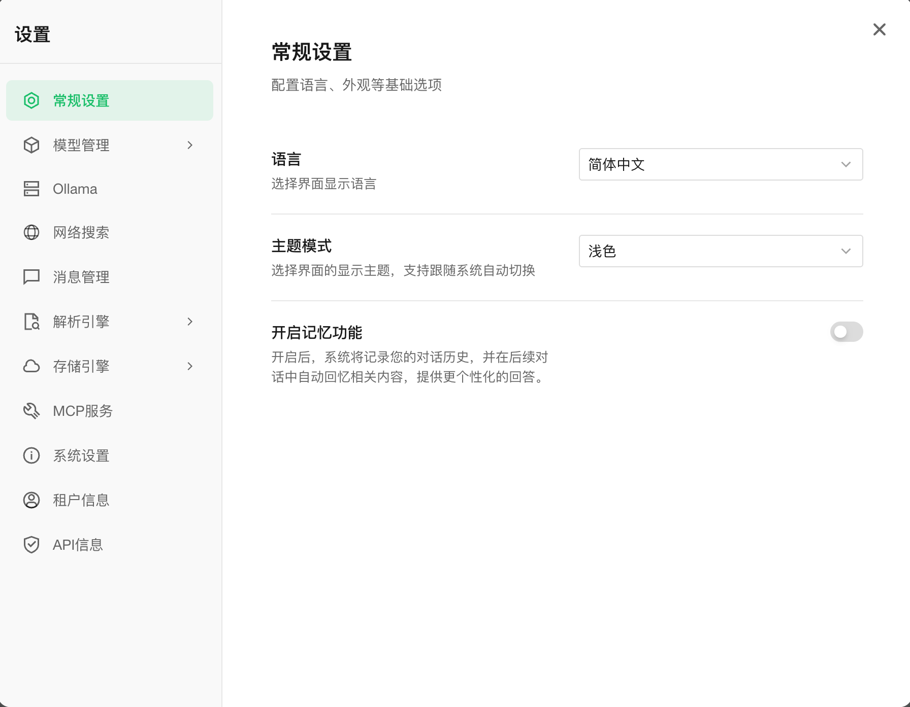
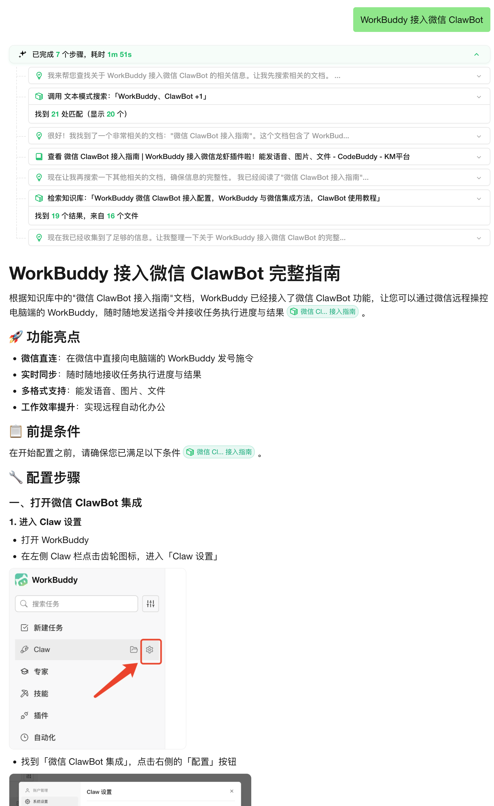

<p align="center">
  <picture>
    
  </picture>
</p>

<p align="center">
  <picture>
    <a href="https://trendshift.io/repositories/15289" target="_blank">
      
    </a>
  </picture>
</p>
<p align="center">
    <a href="https://weknora.weixin.qq.com" target="_blank">
        
    </a>
    <a href="https://chatbot.weixin.qq.com" target="_blank">
        
    </a>
    <a href="https://github.com/Tencent/WeKnora/blob/main/LICENSE">
        
    </a>
    <a href="./CHANGELOG.md">
        
    </a>
</p>

<p align="center">
| <a href="./README.md"><b>English</b></a> | <a href="./README_CN.md"><b>简体中文</b></a> | <b>한국어</b> |
</p>

<p align="center">
  <h4 align="center">

  [개요](#-개요) • [아키텍처](#️-아키텍처) • [핵심 기능](#-핵심-기능) • [시작하기](#-시작하기) • [API 레퍼런스](#-api-레퍼런스) • [개발자 가이드](#-개발자-가이드)

  </h4>
</p>

# 💡 WeKnora - LLM 기반 문서 이해 및 검색 프레임워크

## 📌 개요

[**WeKnora**](https://weknora.weixin.qq.com)는 복잡하고 이질적인 문서를 다루는 데 특화된, LLM 기반의 심층 문서 이해 및 시맨틱 검색 프레임워크입니다.

멀티모달 전처리, 시맨틱 벡터 인덱싱, 지능형 검색, 대규모 언어 모델 추론을 결합한 모듈형 아키텍처를 채택했습니다. 핵심적으로 WeKnora는 **RAG(Retrieval-Augmented Generation)** 패러다임을 따르며, 관련 문서 조각과 모델 추론을 결합해 문맥을 반영한 고품질 답변을 제공합니다.

**웹사이트:** https://weknora.weixin.qq.com

## ✨ 최신 업데이트

**v0.3.0 하이라이트:**

- 🏢 **공유 공간**: 멤버 초대, 멤버 간 지식베이스/에이전트 공유, 테넌트 격리 검색을 지원하는 공유 공간
- 🧩 **Agent Skills**: 스마트 추론 에이전트를 위한 사전 로드 스킬과 샌드박스 기반 보안 격리 실행 환경 제공
- 🤖 **커스텀 에이전트**: 지식베이스 선택 모드(전체/지정/비활성화)와 함께 커스텀 에이전트 생성, 설정, 선택 지원
- 📊 **데이터 분석 에이전트**: CSV/Excel 분석용 DataSchema 도구를 포함한 내장 데이터 분석 에이전트 제공
- 🧠 **사고 모드**: LLM과 에이전트의 사고 모드 지원 및 사고 내용 지능형 필터링
- 🔍 **웹 검색 제공자**: DuckDuckGo 외에 Bing, Google 검색 제공자 추가
- 📋 **FAQ 강화**: 일괄 임포트 드라이런, 유사 질문, 검색 결과 매칭 질문, 대용량 임포트 객체 스토리지 오프로딩
- 🔑 **API Key 인증**: Swagger 문서 보안과 함께 API Key 인증 메커니즘 제공
- 📎 **입력창 내 선택**: 입력창에서 지식베이스/파일을 직접 선택하고 @멘션 표시 지원
- ☸️ **Helm Chart**: Neo4j GraphRAG 지원을 포함한 Kubernetes 배포용 완전한 Helm Chart 제공
- 🌍 **국제화(i18n)**: 한국어(한국어) 언어 지원 추가
- 🔒 **보안 강화**: SSRF 안전 HTTP 클라이언트, 향상된 SQL 검증, MCP stdio 전송 보안, 샌드박스 실행
- ⚡ **인프라**: Qdrant 벡터 DB 지원, Redis ACL, 로그 레벨 설정, Ollama 임베딩 최적화, `DISABLE_REGISTRATION` 제어

**v0.2.0 하이라이트:**

- 🤖 **Agent 모드**: 내장 도구, MCP 도구, 웹 검색을 호출할 수 있는 새로운 ReACT Agent 모드 추가. 다중 반복 및 리플렉션을 통해 종합 요약 리포트 제공
- 📚 **다중 지식베이스 타입**: FAQ/문서 지식베이스 타입 지원 및 폴더 임포트, URL 임포트, 태그 관리, 온라인 입력 기능 추가
- ⚙️ **대화 전략**: Agent 모델, 일반 모드 모델, 검색 임계값, 프롬프트 설정 지원. 멀티턴 대화 동작을 정밀 제어
- 🌐 **웹 검색**: 확장 가능한 웹 검색 엔진 지원, DuckDuckGo 검색 엔진 내장
- 🔌 **MCP 도구 통합**: MCP를 통한 Agent 기능 확장 지원, uvx/npx 런처 내장, 다양한 전송 방식 지원
- 🎨 **새 UI**: Agent/일반 모드 전환, 도구 호출 과정 표시, 지식베이스 관리 인터페이스 전면 개선
- ⚡ **인프라 업그레이드**: MQ 비동기 작업 관리 도입, 자동 DB 마이그레이션 및 고속 개발 모드 지원

## 🔒 보안 공지

**중요:** v0.1.3부터 WeKnora는 시스템 보안 강화를 위해 로그인 인증 기능을 포함합니다. 운영 환경 배포 시 아래 사항을 강력히 권장합니다.

- WeKnora 서비스를 공용 인터넷이 아닌 내부/사설 네트워크 환경에 배포
- 잠재적 정보 유출 방지를 위해 서비스를 공용 네트워크에 직접 노출하지 않기
- 배포 환경에 적절한 방화벽 규칙 및 접근 제어 구성
- 보안 패치와 개선 사항 적용을 위해 최신 버전으로 정기 업데이트

## 🏗️ 아키텍처


WeKnora는 완전한 문서 이해 및 검색 파이프라인을 구축하기 위해 현대적인 모듈형 설계를 채택했습니다. 시스템은 주로 문서 파싱, 벡터 처리, 검색 엔진, 대형 모델 추론 모듈로 구성되며, 각 구성 요소는 유연하게 설정 및 확장할 수 있습니다.

## 🎯 핵심 기능

- **🤖 Agent 모드**: 내장 도구로 지식베이스를 검색하고 MCP 도구/웹 검색 도구를 호출해 외부 서비스에 접근. 다중 반복 및 리플렉션을 통해 종합 요약 리포트 제공
- **🔍 정밀 이해**: PDF, Word, 이미지 등에서 구조화된 내용을 추출해 통합 시맨틱 뷰 구성
- **🧠 지능형 추론**: LLM으로 문서 문맥과 사용자 의도를 이해하여 정확한 Q&A와 멀티턴 대화 지원
- **📚 다중 지식베이스 타입**: FAQ/문서 지식베이스 타입, 폴더 임포트, URL 임포트, 태그 관리, 온라인 입력 지원
- **🔧 유연한 확장성**: 파싱-임베딩-검색-생성 전 과정을 분리해 손쉬운 커스터마이징 가능
- **⚡ 고효율 검색**: 키워드/벡터/지식 그래프를 결합한 하이브리드 검색 및 교차 지식베이스 검색 지원
- **🌐 웹 검색**: 확장 가능한 웹 검색 엔진 지원, DuckDuckGo 기본 제공
- **🔌 MCP 도구 통합**: MCP를 통한 Agent 기능 확장, uvx/npx 런처 내장, 다중 전송 방식 지원
- **⚙️ 대화 전략**: Agent 모델, 일반 모드 모델, 검색 임계값, 프롬프트 설정 지원으로 멀티턴 대화 정밀 제어
- **🎯 사용 편의성**: 직관적인 Web UI와 표준 API 제공으로 진입 장벽 최소화
- **🔒 보안 및 통제**: 로컬/프라이빗 클라우드 배포 지원으로 데이터 주권 보장

## 📊 적용 시나리오

| 시나리오 | 적용 사례 | 핵심 가치 |
|---------|----------|----------|
| **기업 지식 관리** | 내부 문서 검색, 규정 Q&A, 운영 매뉴얼 조회 | 지식 탐색 효율 향상, 교육 비용 절감 |
| **학술 연구 분석** | 논문 검색, 연구 리포트 분석, 학술 자료 정리 | 문헌 조사 가속, 연구 의사결정 지원 |
| **제품 기술 지원** | 제품 매뉴얼 Q&A, 기술 문서 검색, 트러블슈팅 | 고객 지원 품질 향상, 지원 부담 감소 |
| **법무/컴플라이언스 검토** | 계약 조항 검색, 규제 정책 조회, 사례 분석 | 컴플라이언스 효율 향상, 법적 리스크 감소 |
| **의료 지식 지원** | 의학 문헌 검색, 진료 가이드라인 조회, 증례 분석 | 임상 의사결정 지원, 진단 품질 향상 |

## 🧩 기능 매트릭스

| 모듈 | 지원 범위 | 설명 |
|---------|--------------------------------------------------------------------------------|--------------------------------------------------------------------------------------------------------------------------------------------------------------------|
| Agent 모드 | ✅ ReACT Agent Mode | 내장 도구/지식베이스 검색, MCP 도구, 웹 검색 지원. 교차 지식베이스 검색 및 다중 반복 지원 |
| 지식베이스 타입 | ✅ FAQ / Document | FAQ/문서 지식베이스 생성 지원. 폴더 임포트, URL 임포트, 태그 관리, 온라인 입력 지원 |
| 문서 포맷 | ✅ PDF / Word / Txt / Markdown / Images (OCR / Caption 포함) | 구조화/비구조화 문서 처리 및 이미지 텍스트 추출 지원 |
| 모델 관리 | ✅ 중앙 설정, 내장 모델 공유 | 지식베이스 설정에서 모델 선택을 포함한 중앙 모델 관리 및 멀티테넌트 내장 모델 공유 지원 |
| 임베딩 모델 | ✅ 로컬 모델, BGE / GTE API 등 | 커스터마이징 가능한 임베딩 모델. 로컬 배포 및 클라우드 벡터 생성 API와 호환 |
| 벡터 DB 연동 | ✅ PostgreSQL (pgvector), Elasticsearch | 주요 벡터 인덱스 백엔드 지원, 검색 시나리오별 유연한 전환 |
| 검색 전략 | ✅ BM25 / Dense Retrieval / GraphRAG | 희소/밀집 검색 및 지식 그래프 강화 검색 지원. 검색-리랭크-생성 파이프라인 커스터마이징 가능 |
| LLM 연동 | ✅ Qwen, DeepSeek 등 지원, 사고/비사고 모드 전환 | 로컬 모델(예: Ollama) 또는 외부 API 서비스와 연동 가능한 유연한 추론 설정 |
| 대화 전략 | ✅ Agent 모델, 일반 모드 모델, 검색 임계값, 프롬프트 설정 | Agent/일반 모델, 검색 임계값, 온라인 프롬프트 설정 지원. 멀티턴 대화 동작 정밀 제어 |
| 웹 검색 | ✅ 확장 가능한 검색 엔진, DuckDuckGo / Google | 확장 가능한 웹 검색 엔진 지원, DuckDuckGo 기본 제공 |
| MCP 도구 | ✅ uvx, npx 런처, Stdio/HTTP Streamable/SSE | MCP를 통한 Agent 기능 확장. uvx/npx 런처 내장, 세 가지 전송 방식 지원 |
| QA 역량 | ✅ 문맥 인식, 멀티턴 대화, 프롬프트 템플릿 | 복잡한 시맨틱 모델링, 지시 제어, 체인형 Q&A 지원. 프롬프트/컨텍스트 윈도우 설정 가능 |
| E2E 테스트 | ✅ 검색+생성 과정 시각화 및 지표 평가 | 리콜 적중률, 답변 커버리지, BLEU/ROUGE 등 지표를 평가하는 종단간 테스트 도구 제공 |
| 배포 모드 | ✅ 로컬 배포 / Docker 이미지 | 프라이빗/오프라인 배포 및 유연한 운영 요구 충족. 고속 개발 모드 지원 |
| 사용자 인터페이스 | ✅ Web UI + RESTful API | 상호작용 UI와 표준 API 제공. Agent/일반 모드 전환 및 도구 호출 과정 표시 |
| 작업 관리 | ✅ MQ 비동기 작업, 자동 DB 마이그레이션 | MQ 기반 비동기 작업 상태 유지 및 버전 업그레이드 시 스키마/데이터 자동 마이그레이션 지원 |

## 🚀 시작하기

### 🛠 사전 준비

다음 도구가 시스템에 설치되어 있는지 확인하세요:

* [Docker](https://www.docker.com/)
* [Docker Compose](https://docs.docker.com/compose/)
* [Git](https://git-scm.com/)

### 📦 설치

#### ① 저장소 클론

```bash
# 메인 저장소 클론
git clone https://github.com/Tencent/WeKnora.git
cd WeKnora
```

#### ② 환경 변수 설정

```bash
# 예시 환경 파일 복사
cp .env.example .env

# .env 파일을 수정해 필요한 값을 설정
# 모든 변수는 .env.example 주석에 설명되어 있습니다
```

#### ③ 서비스 시작(Ollama 포함)

.env 파일에서 시작해야 하는 이미지를 확인하세요.

```bash
./scripts/start_all.sh
```

또는

```bash
make start-all
```

#### ③.0 ollama 서비스 시작(선택)

```bash
ollama serve > /dev/null 2>&1 &
```

#### ③.1 기능 조합별 실행

- 최소 코어 서비스
```bash
docker compose up -d
```

- 전체 기능 활성화
```bash
docker-compose --profile full up -d
```

- 트레이싱 로그 필요 시
```bash
docker-compose --profile jaeger up -d
```

- Neo4j 지식 그래프 필요 시
```bash
docker-compose --profile neo4j up -d
```

- Minio 파일 스토리지 필요 시
```bash
docker-compose --profile minio up -d
```

- 여러 옵션 조합
```bash
docker-compose --profile neo4j --profile minio up -d
```

#### ④ 서비스 중지

```bash
./scripts/start_all.sh --stop
# 또는
make stop-all
```

### 🌐 서비스 접속 주소

서비스 시작 후 아래 주소로 접속할 수 있습니다:

* Web UI: `http://localhost`
* 백엔드 API: `http://localhost:8080`
* Jaeger 트레이싱: `http://localhost:16686`

### 🔌 WeChat 대화 오픈 플랫폼 사용

WeKnora는 [WeChat 대화 오픈 플랫폼](https://chatbot.weixin.qq.com)의 핵심 기술 프레임워크로 사용되며, 보다 간편한 사용 방식을 제공합니다:

- **노코드 배포**: 지식을 업로드하기만 하면 WeChat 생태계에서 지능형 Q&A 서비스를 빠르게 배포하여 "질문 즉시 응답" 경험을 구현
- **효율적인 질문 관리**: 고빈도 질문의 분류 관리 지원, 풍부한 데이터 도구를 통해 정확하고 신뢰할 수 있으며 유지보수하기 쉬운 답변 제공
- **WeChat 생태계 통합**: WeChat 공식계정, 미니프로그램 등 다양한 시나리오에 WeKnora의 Q&A 역량을 자연스럽게 통합

### 🔗 MCP 서버로 WeKnora 접속

#### 1️⃣ 저장소 클론
```
git clone https://github.com/Tencent/WeKnora
```

#### 2️⃣ MCP 서버 설정
> 설정은 [MCP 설정 가이드](./mcp-server/MCP_CONFIG.md)를 직접 참고하는 것을 권장합니다.

MCP 클라이언트에서 서버 연결을 설정합니다:
```json
{
  "mcpServers": {
    "weknora": {
      "args": [
        "path/to/WeKnora/mcp-server/run_server.py"
      ],
      "command": "python",
      "env":{
        "WEKNORA_API_KEY":"WeKnora 인스턴스에서 개발자 도구를 열고, sk로 시작하는 요청 헤더 x-api-key를 확인",
        "WEKNORA_BASE_URL":"http(s)://your-weknora-address/api/v1"
      }
    }
  }
}
```

stdio 명령으로 직접 실행:
```
pip install weknora-mcp-server
python -m weknora-mcp-server
```

## 🔧 초기 설정 가이드

사용자가 다양한 모델을 빠르게 설정하고 시행착오 비용을 줄일 수 있도록, 기존 설정 파일 초기화 방식을 개선하고 Web UI 기반 설정 인터페이스를 추가했습니다. 사용 전에 코드가 최신 버전인지 확인하세요. 절차는 아래와 같습니다.
프로젝트를 처음 사용하는 경우 ①② 단계를 건너뛰고 ③④로 바로 진행해도 됩니다.

### ① 서비스 중지

```bash
./scripts/start_all.sh --stop
```

### ② 기존 데이터 테이블 정리(중요 데이터가 없을 때 권장)

```bash
make clean-db
```

### ③ 컴파일 및 서비스 시작

```bash
./scripts/start_all.sh
```

### ④ Web UI 접속

http://localhost

처음 접속하면 자동으로 회원가입/로그인 페이지로 이동합니다. 가입 완료 후 새 지식베이스를 생성하고 설정 페이지에서 필요한 항목을 구성하세요.

## 📱 인터페이스 소개

### Web UI 인터페이스

<table>
  <tr>
    <td><b>지식베이스 관리</b><br/></td>
    <td><b>대화 설정</b><br/></td>
  </tr>
  <tr>
    <td colspan="2"><b>Agent 모드 도구 호출 과정</b><br/></td>
  </tr>
</table>

**지식베이스 관리:** FAQ/문서 지식베이스 타입 생성 지원, 드래그 앤 드롭/폴더/URL 임포트 등 다양한 방식 지원. 문서 구조를 자동 식별하고 핵심 지식을 추출해 인덱스를 구축합니다. 태그 관리와 온라인 입력을 지원하며, 처리 진행 상황과 문서 상태를 명확히 표시해 효율적인 지식베이스 운영을 돕습니다.

**Agent 모드:** ReACT Agent 모드를 지원하며, 내장 도구로 지식베이스 검색, 사용자 설정 MCP 도구 및 웹 검색 도구 호출을 통해 외부 서비스 접근이 가능합니다. 다중 반복과 리플렉션을 통해 종합 요약 리포트를 제공합니다. 교차 지식베이스 검색도 지원하여 여러 지식베이스를 동시에 검색할 수 있습니다.

**대화 전략:** Agent 모델, 일반 모드 모델, 검색 임계값, 온라인 프롬프트 설정을 지원하여 멀티턴 대화 동작과 검색 실행 방식을 정밀하게 제어할 수 있습니다. 입력창에서 Agent/일반 모드 전환, 웹 검색 활성화/비활성화, 대화 모델 선택을 지원합니다.

### 문서 지식 그래프

WeKnora는 문서를 지식 그래프로 변환해 문서 내 서로 다른 섹션 간 관계를 시각화할 수 있습니다. 지식 그래프 기능을 활성화하면 문서 내부의 시맨틱 연관 네트워크를 분석/구성하여 문서 이해를 돕고, 인덱싱과 검색에 구조화된 지원을 제공해 검색 결과의 관련성과 폭을 향상시킵니다.

자세한 설정은 [지식 그래프 설정 가이드](./docs/KnowledgeGraph.md)를 참고하세요.

### MCP 서버

필요한 설정은 [MCP 설정 가이드](./mcp-server/MCP_CONFIG.md)를 참고하세요.

## 📘 API 레퍼런스

문제 해결 FAQ: [문제 해결 FAQ](./docs/QA.md)

상세 API 문서: [API Docs](./docs/api/README.md)

제품 계획 및 예정 기능: [Roadmap](./docs/ROADMAP.md)

## 🧭 개발자 가이드

### ⚡ 고속 개발 모드(권장)

코드를 자주 수정해야 한다면 **매번 Docker 이미지를 다시 빌드할 필요가 없습니다**. 고속 개발 모드를 사용하세요.

```bash
# 방법 1: Make 명령 사용 (권장)
make dev-start      # 인프라 시작
make dev-app        # 백엔드 시작 (새 터미널)
make dev-frontend   # 프론트엔드 시작 (새 터미널)

# 방법 2: 원클릭 시작
./scripts/quick-dev.sh

# 방법 3: 스크립트 사용
./scripts/dev.sh start     # 인프라 시작
./scripts/dev.sh app       # 백엔드 시작 (새 터미널)
./scripts/dev.sh frontend  # 프론트엔드 시작 (새 터미널)
```

**개발 장점:**
- ✅ 프론트엔드 변경 자동 핫리로드(재시작 불필요)
- ✅ 백엔드 변경 빠른 재시작(5~10초, Air 핫리로드 지원)
- ✅ Docker 이미지 재빌드 불필요
- ✅ IDE 브레이크포인트 디버깅 지원

**상세 문서:** [개발 환경 빠른 시작](./docs/开发指南.md)

### 📁 디렉터리 구조

```
WeKnora/
├── client/      # go client
├── cmd/         # Main entry point
├── config/      # Configuration files
├── docker/      # docker images files
├── docreader/   # Document parsing app
├── docs/        # Project documentation
├── frontend/    # Frontend app
├── internal/    # Core business logic
├── mcp-server/  # MCP server
├── migrations/  # DB migration scripts
└── scripts/     # Shell scripts
```

## 🤝 기여하기

커뮤니티 기여를 환영합니다! 제안, 버그, 기능 요청은 [Issue](https://github.com/Tencent/WeKnora/issues)로 등록하거나 Pull Request를 직접 생성해 주세요.

### 🎯 기여 방법

- 🐛 **버그 수정**: 시스템 결함 발견 및 수정
- ✨ **새 기능**: 새로운 기능 제안 및 구현
- 📚 **문서 개선**: 프로젝트 문서 품질 향상
- 🧪 **테스트 케이스**: 단위/통합 테스트 작성
- 🎨 **UI/UX 개선**: 사용자 인터페이스와 경험 개선

### 📋 기여 절차

1. **프로젝트를 Fork** 해서 본인 GitHub 계정으로 가져오기
2. **기능 브랜치 생성** `git checkout -b feature/amazing-feature`
3. **변경사항 커밋** `git commit -m 'Add amazing feature'`
4. **브랜치 푸시** `git push origin feature/amazing-feature`
5. **Pull Request 생성** 후 변경 내용을 자세히 설명

### 🎨 코드 규칙

- [Go Code Review Comments](https://github.com/golang/go/wiki/CodeReviewComments) 준수
- `gofmt`로 코드 포맷팅
- 필요한 단위 테스트 추가
- 관련 문서 업데이트

### 📝 커밋 가이드

[Conventional Commits](https://www.conventionalcommits.org/) 규칙 사용:

```
feat: 문서 일괄 업로드 기능 추가
fix: 벡터 검색 정확도 문제 수정
docs: API 문서 업데이트
test: 검색 엔진 테스트 케이스 추가
refactor: 문서 파싱 모듈 리팩터링
```

## 👥 기여자

멋진 기여자 여러분께 감사드립니다:

[](https://github.com/Tencent/WeKnora/graphs/contributors)

## 📄 라이선스

이 프로젝트는 [MIT License](./LICENSE)로 배포됩니다.
적절한 저작권 고지를 유지하는 조건으로 코드를 자유롭게 사용, 수정, 배포할 수 있습니다.

## 📈 프로젝트 통계

<a href="https://www.star-history.com/#Tencent/WeKnora&type=date&legend=top-left">
 <picture>
   <source media="(prefers-color-scheme: dark)" srcset="https://api.star-history.com/svg?repos=Tencent/WeKnora&type=date&theme=dark&legend=top-left" />
   <source media="(prefers-color-scheme: light)" srcset="https://api.star-history.com/svg?repos=Tencent/WeKnora&type=date&legend=top-left" />
   
 </picture>
</a>
