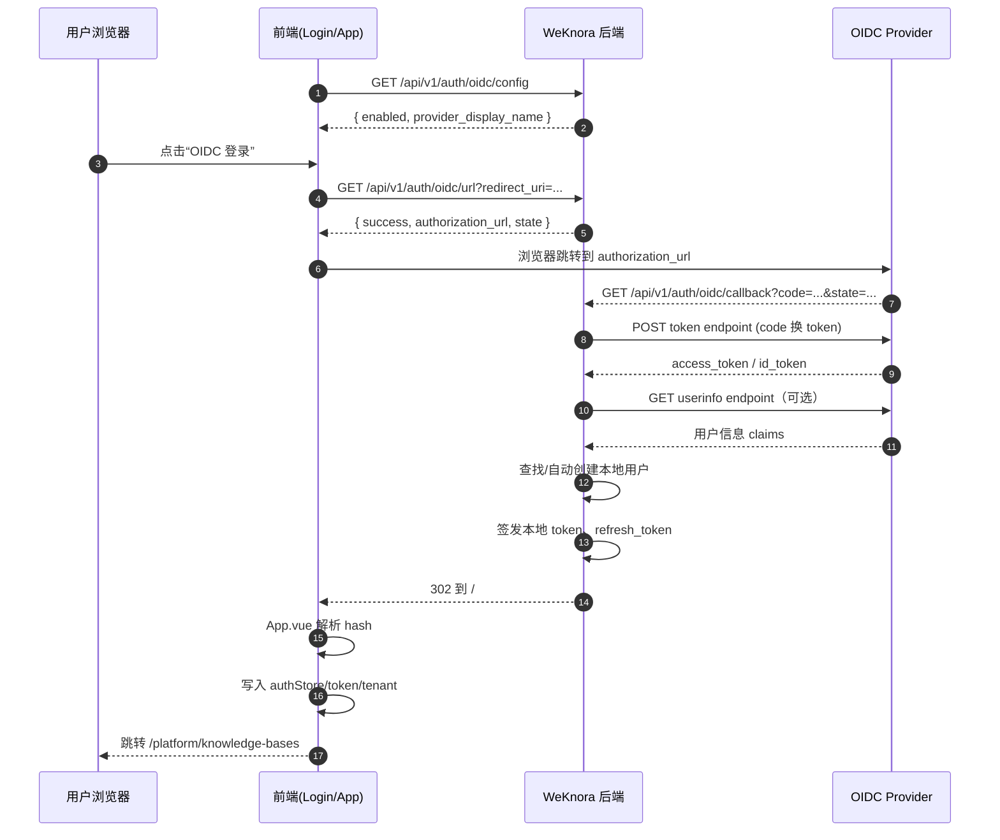
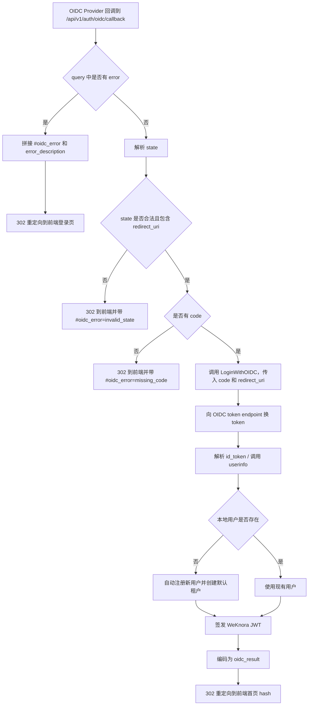

# WeKnora OIDC 认证调用流程

本文档说明 WeKnora 当前 OIDC 登录能力的实际调用过程，覆盖：

- 前端如何判断是否展示 OIDC 登录入口
- 用户点击 OIDC 登录后的前后端调用链路
- 后端如何与 OIDC Provider 交互
- 登录成功后前端如何接收结果并落盘本地登录态
- 关键配置项与本地联调方式

本文内容基于当前项目实现，相关代码主要位于：

- 后端路由：`internal/router/router.go`
- 认证处理：`internal/handler/auth.go`
- 认证服务：`internal/application/service/user.go`
- 配置定义：`internal/config/config.go`
- 前端登录页：`frontend/src/views/auth/Login.vue`
- 前端全局回调处理：`frontend/src/App.vue`
- 前端认证 API：`frontend/src/api/auth/index.ts`
- 本地 Dex 示例：`misc/dex-config.yaml`

---

## 1. 整体设计说明

本项目的 OIDC 登录采用的是 **后端发起授权参数生成、后端接收回调并完成 code 换 token、前端通过 URL hash 接收最终登录结果** 的模式。

和常见的纯前端 OIDC SDK 不同，WeKnora 的特点是：

1. **前端只负责发起跳转**，不直接和 OIDC Provider 交换 token。
2. **后端负责用授权码 `code` 向 OIDC Provider 换取 token**。
3. 后端拿到 OIDC 用户信息后，会：
   - 查找本地用户；
   - 若用户不存在，则自动创建本地账号和默认租户；
   - 最终签发 WeKnora 自己的本地 JWT（`token` / `refresh_token`）。
4. 后端不会直接把登录结果放在 query string 中，而是：
   - 将结果 JSON 序列化后再做 base64url 编码；
   - 以 `#oidc_result=...` 的形式重定向回前端；
   - 前端在 `App.vue` 中统一解析 hash，完成登录态持久化。

因此，**OIDC Provider 的 token 只用于后端换取用户身份，本项目真正的业务访问凭证仍然是 WeKnora 自己签发的 JWT**。

---

## 2. 相关接口

当前 OIDC 相关接口均注册在 `internal/router/router.go` 中：

- `GET /api/v1/auth/oidc/config`
  - 获取 OIDC 是否启用，以及 Provider 展示名称
- `GET /api/v1/auth/oidc/url`
  - 生成第三方登录跳转地址
- `GET /api/v1/auth/oidc/callback`
  - OIDC Provider 回调地址

其中，前端常规登录仍然使用：

- `POST /api/v1/auth/login`
- `POST /api/v1/auth/refresh`
- `POST /api/v1/auth/logout`
- `GET /api/v1/auth/me`

---

## 3. 调用流程图

### 3.1 总体时序图



### 3.2 后端回调处理分支图



---

## 4. 前端调用流程

## 4.1 登录页初始化：决定是否展示 OIDC 登录按钮

登录页组件位于 `frontend/src/views/auth/Login.vue`。

页面加载时会执行：

```ts
loadOIDCConfig()
```

该函数调用：

```ts
getOIDCConfig() -> GET /api/v1/auth/oidc/config
```

后端 `GetOIDCConfig` 会读取 `configInfo.OIDCAuth`：

- `enabled`: 是否启用 OIDC
- `provider_display_name`: 登录按钮上展示的供应商名称

前端据此决定：

- 是否显示 OIDC 登录按钮；
- 按钮文案是否显示为“使用 XXX 登录”。

---

## 4.2 用户点击 OIDC 登录按钮

用户点击按钮后，`Login.vue` 中会执行 `handleOIDCLogin()`。

核心逻辑：

1. 前端先构造后端回调地址：

```ts
const getBackendOIDCRedirectURI = () => `${window.location.origin}/api/v1/auth/oidc/callback`
```

其中：

- `redirect_uri`：提供给 OIDC Provider 的回调地址，必须是后端地址。

登录成功后，后端固定回跳前端首页 `/`，并通过 hash 传递 OIDC 结果。

2. 前端调用：

```ts
GET /api/v1/auth/oidc/url?redirect_uri=...
```

3. 后端返回 `authorization_url` 后，前端直接执行：

```ts
window.location.href = authorizationURL
```

浏览器随后离开 WeKnora 页面，跳转到 OIDC Provider 的授权页。

---

## 5. 后端生成授权地址

对应处理器：`AuthHandler.GetOIDCAuthorizationURL`

对应服务：`userService.GetOIDCAuthorizationURL`

### 5.1 参数校验

后端要求以下参数必须存在：

- `redirect_uri`

否则直接返回校验错误。

### 5.2 读取 OIDC 配置

`getOIDCConfig()` 会执行以下逻辑：

1. 检查 `OIDCAuth.Enable` 是否为 `true`；
2. 设置默认值：
   - `ProviderDisplayName` 默认是 `OIDC`
   - `Scopes` 默认是 `openid profile email`
   - `UserInfoMapping.Username` 默认是 `name`
   - `UserInfoMapping.Email` 默认是 `email`
3. 若未显式配置授权/令牌端点，则通过 `discovery_url` 拉取 OIDC Discovery 文档；
4. 自动补齐：
   - `authorization_endpoint`
   - `token_endpoint`
   - `userinfo_endpoint`

### 5.3 生成 state

后端不会把 state 只当成随机串，而是编码了一个 JSON 结构：

```json
{
  "nonce": "随机字符串",
  "redirect_uri": "后端回调地址"
}
```

然后再做 base64url 编码，作为 `state` 传给 Provider。

这样在 OIDC Provider 回调时，后端就可以从 `state` 里还原：

- 本次使用的后端 `redirect_uri`

### 5.4 拼接授权地址

后端最终拼接的参数包含：

- `response_type=code`
- `client_id`
- `redirect_uri`
- `scope`
- `state`

然后返回给前端：

```json
{
  "success": true,
  "provider_display_name": "Dex",
  "authorization_url": "...",
  "state": "..."
}
```

---

## 6. OIDC Provider 回调到后端

OIDC Provider 完成认证后，会回调：

```text
GET /api/v1/auth/oidc/callback
```

处理器为 `AuthHandler.OIDCRedirectCallback`。

### 6.1 Provider 返回错误时

如果 query 中带有：

- `error`
- `error_description`

后端不会返回 JSON，而是直接 302 到前端首页 `/`，并带上 hash：

```text
#oidc_error=...&oidc_error_description=...
```

### 6.2 解析 state

后端会把 `state` 做 base64url 解码并解析为结构体。

如果出现以下情况，将判定失败：

- `state` 无法解码
- JSON 结构非法
- `state.redirect_uri` 为空

失败时会重定向到前端首页：

```text
#oidc_error=invalid_state
```

### 6.3 校验 code

如果没有收到 `code`，则重定向：

```text
#oidc_error=missing_code
```

### 6.4 正式执行 OIDC 登录

若 `state` 与 `code` 都合法，则调用：

```go
LoginWithOIDC(ctx, code, decodedState.RedirectURI)
```

注意这里传入的是 **state 中保存的 redirect_uri**，而不是重新拼接的地址，这样保证了 code 交换时使用的 `redirect_uri` 和授权时完全一致。

---

## 7. 后端用 code 换 token 并解析用户身份

核心逻辑位于 `internal/application/service/user.go`。

## 7.1 换取 OIDC token

`exchangeOIDCCode()` 会向 OIDC Provider 的 `token_endpoint` 发起：

```text
POST application/x-www-form-urlencoded
```

表单参数包括：

- `grant_type=authorization_code`
- `code`
- `redirect_uri`
- `client_id`
- `client_secret`

期望返回字段：

- `access_token`
- `id_token`
- `token_type`

如果 `access_token` 和 `id_token` 都缺失，则认为失败。

## 7.2 解析用户信息

`resolveOIDCUserInfo()` 的处理顺序是：

1. 如果有 `id_token`，先本地解码 JWT payload，提取 claims；
2. 如果配置了 `userinfo_endpoint` 且有 `access_token`，再调用 userinfo 接口；
3. 将两部分 claims 合并，userinfo 的字段可覆盖前面已取到的字段；
4. 根据配置的 `user_info_mapping` 提取：
   - 用户名字段
   - 邮箱字段

默认映射：

- `username -> name`
- `email -> email`

另外还有回退逻辑：

1. 若 username 为空，尝试 `preferred_username`
2. 再尝试 `name`
3. 再尝试从邮箱前缀生成用户名

如果最终没有拿到邮箱，则直接报错，因为本地用户是按 email 关联的。

---

## 8. 本地用户关联与自动开通

### 8.1 通过邮箱查找用户

后端使用 OIDC 返回的邮箱执行：

```go
userRepo.GetUserByEmail(ctx, userInfo.Email)
```

### 8.2 用户不存在时自动注册

若本地不存在该邮箱用户，则调用 `provisionOIDCUser()` 自动创建账号。

自动创建逻辑包括：

1. 根据 OIDC 用户名/邮箱生成本地用户名；
2. 若用户名冲突，则自动追加 `-1`、`-2` 等后缀；
3. 生成随机密码；
4. 调用现有 `Register()` 流程创建用户；
5. `Register()` 内部还会自动创建默认租户。

因此，**首次使用 OIDC 登录的用户，不需要提前在 WeKnora 中手工建号**。

### 8.3 用户禁用处理

如果找到的本地用户 `IsActive=false`，则登录失败，回调给前端的错误信息为：

```text
Account is disabled
```

---

## 9. 生成 WeKnora 本地登录态

OIDC 登录成功后，后端不会直接把 OIDC token 交给前端使用，而是继续执行：

```go
GenerateTokens(ctx, user)
```

生成两类 JWT：

- `token`：访问令牌，默认 24 小时
- `refresh_token`：刷新令牌，默认 7 天

并写入本地 `auth_tokens` 存储（通过 `tokenRepo.CreateToken`）。

最终后端还会查询当前用户所属租户，并返回：

- `user`
- `tenant`
- `token`
- `refresh_token`
- `is_new_user`

这一步意味着：

> OIDC 只负责“确认你是谁”，WeKnora 自己负责“签发系统内可用的业务令牌”。

---

## 10. 后端如何把结果传回前端

`OIDCRedirectCallback` 在拿到 `OIDCCallbackResponse` 后，会执行：

1. 将响应对象 JSON 序列化；
2. 用 base64url 编码；
3. 302 重定向到：

```text
/#oidc_result=ENCODED_PAYLOAD
```

失败时则返回：

```text
/#oidc_error=...&oidc_error_description=...
```

这里使用 hash 的好处是：

- 不会把结果作为 query 参数再次发送给服务端；
- 前端可以在浏览器本地直接读取并清理；
- 避免刷新时重复向后端暴露这些参数。

---

## 11. 前端如何消费 OIDC 回调结果

前端不是在 `Login.vue` 中处理回调，而是在 `frontend/src/App.vue` 中统一处理。

这样即使后端把用户重定向到 `/`，应用根组件也能接住这次 OIDC 登录结果。

## 11.1 App.vue 解析 hash

应用挂载时执行：

```ts
handleGlobalOIDCCallback()
```

它会读取：

```ts
window.location.hash
```

并解析以下字段：

- `oidc_error`
- `oidc_error_description`
- `oidc_result`

## 11.2 错误分支

如果存在 `oidc_error`：

1. 调用 `clearOIDCCallbackState('/login')` 清理 URL；
2. 跳转到 `/login`；
3. 弹出错误消息。

## 11.3 成功分支

如果存在 `oidc_result`：

1. base64url 解码并反序列化；
2. 如果 `response.success=true`：
   - 写入 `authStore.setUser(...)`
   - 写入 `authStore.setToken(...)`
   - 写入 `authStore.setRefreshToken(...)`
   - 写入 `authStore.setTenant(...)`
3. 最终跳转到：

```text
/platform/knowledge-bases
```

这与普通账号密码登录成功后的持久化逻辑保持一致。

---

## 12. 关键配置项

OIDC 配置定义位于 `internal/config/config.go`，环境变量示例见 `.env.example`。

### 12.1 主要配置项

| 配置项 | 说明 |
|---|---|
| `OIDC_AUTH_ENABLE` | 是否启用 OIDC 登录 |
| `OIDC_AUTH_ISSUER_URL` | Issuer 地址，可用于自动拼 discovery URL |
| `OIDC_AUTH_DISCOVERY_URL` | OIDC Discovery 地址 |
| `OIDC_AUTH_PROVIDER_DISPLAY_NAME` | 前端按钮显示名称 |
| `OIDC_AUTH_CLIENT_ID` | OIDC Client ID |
| `OIDC_AUTH_CLIENT_SECRET` | OIDC Client Secret |
| `OIDC_AUTH_AUTHORIZATION_ENDPOINT` | 授权端点，可选 |
| `OIDC_AUTH_TOKEN_ENDPOINT` | Token 端点，可选 |
| `OIDC_AUTH_USER_INFO_ENDPOINT` | UserInfo 端点，可选 |
| `OIDC_AUTH_SCOPES` | Scope 列表，默认 `openid profile email` |
| `OIDC_USER_INFO_MAPPING_USER_NAME` | claims 中映射到用户名的字段名 |
| `OIDC_USER_INFO_MAPPING_EMAIL` | claims 中映射到邮箱的字段名 |

### 12.2 启用时的最小要求

当 `OIDC_AUTH_ENABLE=true` 时，后端校验要求：

1. 必须有 `client_id`
2. 必须有 `client_secret`
3. 必须满足以下二选一：
   - 配置 `discovery_url`
   - 或同时配置 `authorization_endpoint + token_endpoint`

---

## 13. 本地联调示例（Dex）
[Dex](https://dexidp.io/) 是一个简单易用的OIDC Provider，您可以通过它对接多种第三方认证系统（如OAuth2.0，Google，GitHub，LDAP等）。除了Dex之外，您也可以选择[KeyCloak](https://www.keycloak.org/)等其他符合OpenID Connect协议的Provider进行接入。

项目中已提供 Dex 示例配置：`misc/dex-config.yaml`。

其中静态客户端配置示例：

```yaml
staticClients:
  - id: weknora
    redirectURIs:
      - 'http://127.0.0.1:5173/api/v1/auth/oidc/callback'
      - 'http://127.0.0.1/api/v1/auth/oidc/callback'
    name: 'WeKnora'
    # secret: <YOUR_SECRET_HERE>
```

这说明本地调试时，需要确保 **Provider 注册的 redirect URI 与前端实际传给后端的 `redirect_uri` 完全一致**。

前端当前实现中使用的是：

```ts
${window.location.origin}/api/v1/auth/oidc/callback
```

所以：

- 若前端从 `http://127.0.0.1:5173` 访问，则 redirect URI 为
  `http://127.0.0.1:5173/api/v1/auth/oidc/callback`
- 若通过 Nginx 统一入口访问，则可能是
  `http://127.0.0.1/api/v1/auth/oidc/callback`

Provider 必须提前把这些地址加入白名单。

---

## 14. 调用链路总结

可以把当前 OIDC 登录理解为以下 4 个阶段：

### 阶段一：前端发现能力

前端调用 `/auth/oidc/config`，决定是否展示第三方登录入口。

### 阶段二：浏览器跳转授权

前端调用 `/auth/oidc/url` 获取授权地址，然后跳转到 OIDC Provider。

### 阶段三：后端完成身份兑换

Provider 回调后端 `/auth/oidc/callback`，后端用 `code` 换 token、拉取用户信息、关联或创建本地用户，并签发 WeKnora JWT。

### 阶段四：前端接收最终结果

后端 302 回前端，并通过 `#oidc_result` 传递登录结果；前端在 `App.vue` 中统一解析，写入本地登录态并进入业务页面。

---

## 15. 注意事项

1. **`redirect_uri` 必须严格匹配** Provider 客户端配置。
2. **前端首页不是 OIDC Provider 回调地址**。
   - Provider 回调的是后端 `/api/v1/auth/oidc/callback`
	   - 后端再固定重定向到前端首页 `/`
3. **邮箱是本地账号关联主键**。
   - 若 Provider 没返回 email，将无法完成登录。
4. **首次 OIDC 登录会自动创建用户和默认租户**。
5. **真正用于访问 WeKnora API 的仍是本地 JWT**，不是 OIDC access token。
6. 当前实现对 `state` 做了编码封装，但 **没有服务端持久化 state/nonce 校验**；它主要用于传递上下文和基本防错，而不是完整的防重放机制。

---

## 16. 相关源码定位

- 前端是否展示 OIDC 登录按钮：
  - `frontend/src/views/auth/Login.vue`
- 前端获取授权地址：
  - `frontend/src/api/auth/index.ts`
  - `frontend/src/views/auth/Login.vue`
- 前端解析回调 hash：
  - `frontend/src/App.vue`
- OIDC 接口路由注册：
  - `internal/router/router.go`
- OIDC HTTP 处理：
  - `internal/handler/auth.go`
- OIDC 业务逻辑：
  - `internal/application/service/user.go`
- OIDC 配置结构与环境变量覆盖：
  - `internal/config/config.go`
- Dex 本地示例：
  - `misc/dex-config.yaml`
