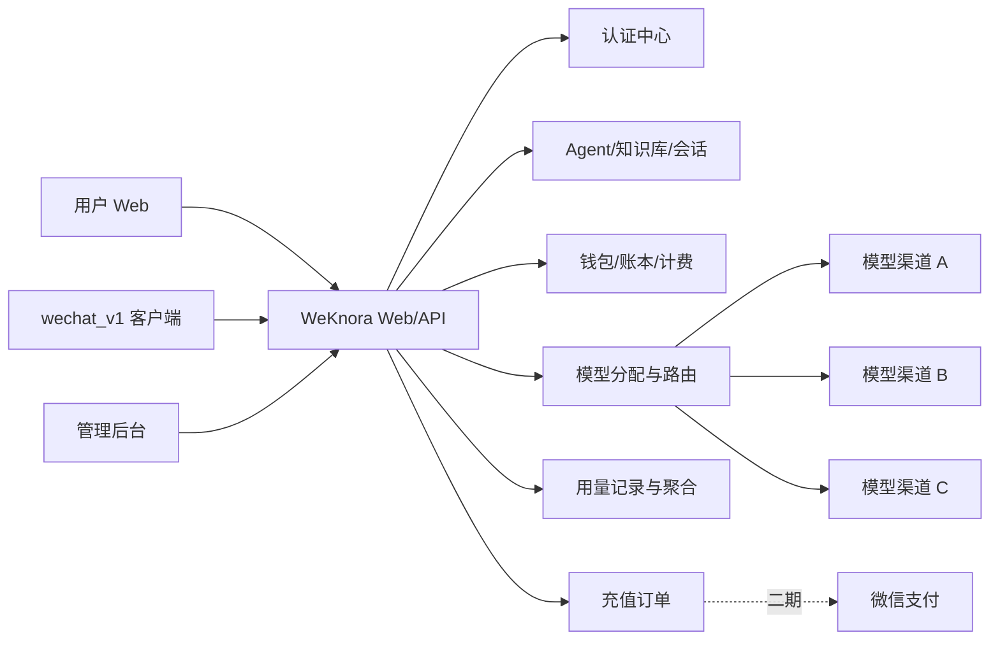

# WeKnora 商用化微信机器人系统设计

## 1. 背景

目标是在尽量复用现有 `D:\AAAlimenAI\wechat_bot\WeKnora` 与 `D:\AAAlimenAI\wechat_bot\RPA\wechat_v1` 的前提下，快速上线一套可商用的微信机器人系统：

- 用户通过 WeKnora 注册、登录、充值、创建 Agent、创建知识库、查看费用
- 微信机器人复用 WeKnora 的 Agent/知识库能力进行问答
- 用户不接触上游大模型 API Key、Base URL、路由策略
- 管理员统一配置模型、渠道、价格、充值与风控
- 首期采用个人用户体系，后续平滑扩展到团队/租户体系

## 2. 设计原则

### 2.1 最小改动优先

- WeKnora 继续作为统一 Web/API 核心
- `wechat_v1` 继续作为微信侧执行客户端
- 首期不拆独立计费服务、不拆独立模型网关

### 2.2 用户只关注业务能力

用户侧保持当前 WeKnora 的 Agent 配置和问答权重设置不变，仅新增：

- 登录后使用
- 余额与充值
- 费用总览
- 费用明细追溯

### 2.3 管理端控制资源

API Key、模型分配、渠道选择、单价、限流、故障切换全部由后台决定。

### 2.4 先个人、后团队

产品层首期按“个人用户体系”提供能力；系统层保留 `tenant_id` 与资源归属扩展位，为未来团队版保留空间。

### 2.5 稳定性先于复杂功能

首期优先完成：

- 认证
- 钱包与计费
- 人工充值
- 模型后台分配
- 微信登录接入

将企业协作、发票、优惠券、复杂套餐等能力后置。

## 3. 推荐总体架构

## 4. 用户视角与管理员视角

### 4.1 用户侧能力

保留并增强：

- 注册/登录
- Agent 管理
- 知识库管理
- 对话
- 当前余额
- 人工充值记录 / 后续微信支付充值
- 费用 Overview
- token/费用明细
- 微信机器人登录接入

### 4.2 用户侧隐藏项

隐藏或不暴露：

- API Key
- Base URL
- 供应商
- 渠道路由策略
- 模型池与成本细节
- 复杂计费配置

### 4.3 管理员侧能力

- 用户管理
- 钱包与账本管理
- 人工充值
- 充值订单管理
- 模型目录管理
- 渠道/API Key 管理
- 用户可用模型分配
- 价格管理
- 使用量与成本监控
- 限流、熔断、健康状态查看

## 5. 认证设计

### 5.1 WeKnora Web

复用现有认证体系：

- `/auth/register`
- `/auth/login`
- `/auth/refresh`
- `/auth/me`

首期只增强访问控制：

- 未登录不可使用 Agent、知识库、聊天、费用页面
- 管理后台新增管理员权限校验

### 5.2 `wechat_v1`

客户端改造为登录后调用：

1. 用户输入 WeKnora 地址、账号、密码
2. 客户端调用 `/auth/login`
3. 保存 `access_token + refresh_token`
4. 后续请求统一带 `Authorization: Bearer <token>`
5. token 过期时自动刷新
6. 未登录或余额不足时不允许机器人继续工作

## 6. 商业化计费设计

### 6.1 核心模式

采用：

- 预充值钱包
- 实时计费
- 不可变账本

### 6.2 计费对象

首期至少覆盖：

- 聊天问答
- 知识库导入解析
- embedding
- rerank
- OCR / VLM

### 6.3 计费记录

每次调用落一条 usage 记录，记录：

- 用户
- tenant
- 业务场景
- 会话/消息
- Agent
- 知识库/文档
- 模型
- 实际渠道
- input tokens
- output tokens
- cached tokens
- 价格快照
- 成本
- 售价
- 扣费金额

### 6.4 钱包设计

- 每个用户一个钱包账户
- 每次充值、扣费、退款、调账都写账本
- 账本只追加，不覆盖

## 7. 模型分配与路由设计

### 7.1 路由策略的边界

路由策略只属于管理端，不属于用户端。

用户选的是产品可见的逻辑模型；后台决定最终使用哪个真实供应商渠道。

### 7.2 首期路由能力

首期只做最小可商用路由：

- 一个逻辑模型支持多个渠道
- 主渠道优先
- 失败自动切备用渠道
- 可配置权重轮询
- 渠道级并发上限
- 渠道健康状态标记

### 7.3 后续增强

- 成本优先
- 延迟优先
- 套餐/VIP 分层
- 场景级路由（聊天、embedding、rerank、OCR 不同通道）

## 8. 数据模型建议

### 8.1 复用与新增原则

尽量复用现有 `user` / `tenant` / `model` / `message` / `session` 体系；新增商用表。

### 8.2 建议新增表

- `wallet_accounts`
- `wallet_ledger`
- `recharge_orders`
- `payment_transactions`
- `model_provider_channels`
- `model_route_policies`
- `tenant_model_entitlements`
- `usage_records`
- `usage_daily_stats`
- `admin_operation_logs`

### 8.3 关键字段建议

#### wallet_accounts

- id
- user_id
- tenant_id
- balance
- frozen_amount
- currency
- status

#### wallet_ledger

- id
- wallet_account_id
- user_id
- tenant_id
- biz_type(recharge/debit/refund/manual_adjust)
- amount
- balance_before
- balance_after
- related_order_id
- related_usage_id
- operator_user_id
- remark

#### usage_records

- id
- user_id
- tenant_id
- scene(chat/kb_import/embedding/rerank/ocr)
- session_id
- message_id
- agent_id
- knowledge_base_id
- document_id
- logical_model_code
- provider_channel_id
- provider_model_name
- input_tokens
- output_tokens
- cached_tokens
- unit_price_snapshot
- cost_snapshot
- charge_amount
- status

#### model_provider_channels

- id
- logical_model_code
- provider_name
- base_url
- api_key_encrypted
- priority
- weight
- max_concurrency
- health_status
- is_enabled

## 9. Overview 页面设计

### 9.1 用户费用总览

展示：

- 当前余额
- 今日消耗
- 本月消耗
- 累计充值
- 累计 token

### 9.2 按业务维度

- 对话
- 知识库导入
- embedding
- rerank
- OCR/VLM

### 9.3 按模型维度

- 逻辑模型聚合消耗

### 9.4 明细追溯

支持追溯到：

- 哪个会话
- 哪条消息
- 哪个 Agent
- 哪个知识库
- 哪个文档
- 哪个模型
- 哪个渠道
- 消耗多少
- 扣费多少

## 10. 充值设计

### 10.1 首期

只做人工充值：

- 管理员后台为用户加款
- 写充值订单
- 写钱包账本
- 写操作审计

### 10.2 二期

接微信支付：

- 充值套餐
- 支付下单
- 回调入账
- 幂等校验
- 对账补单

## 11. 多用户稳定性设计

### 11.1 并发控制

- 渠道级并发限制
- 用户级频率限制
- 租户级频率限制

### 11.2 容错

- 渠道失败自动切换
- 超时熔断
- 探活恢复

### 11.3 实时与异步分离

- 聊天请求走实时链路
- 文档导入、OCR、embedding、重排尽量走异步任务

### 11.4 数据聚合

- usage 明细实时写入
- 日报表异步聚合

## 12. 分阶段路线

### Phase 1：快速商用 MVP

- 登录必需
- `wechat_v1` 登录后调用
- 人工充值
- 钱包余额
- 聊天 token 计费
- 用户费用总览
- 管理端模型分配

### Phase 2：完整用量追踪与路由增强

- embedding / rerank / OCR / 导入场景计费
- 多渠道池
- 健康检查
- 备用切换
- 细粒度费用明细

### Phase 3：微信支付

- 支付订单
- 支付回调
- 对账
- 补单

### Phase 4：运营增强

- 套餐
- 优惠
- 团队版
- 利润分析
- 审计报表

## 13. 明确不做的首期范围

首期不做或不暴露：

- 企业多成员协作
- 发票
- 复杂套餐中心
- 优惠券
- 分销
- 用户自配上游 API

## 14. 结论

推荐路线是：

- **WeKnora 保持单体核心，增加商业化能力**
- **wechat_v1 改为“登录后使用 WeKnora 平台”的客户端**
- **前台尽量不改 Agent 使用方式**
- **后台统一管模型、API、价格、充值与稳定性**

这条路线兼顾了最小改动、快速上线和后续可扩展性。
